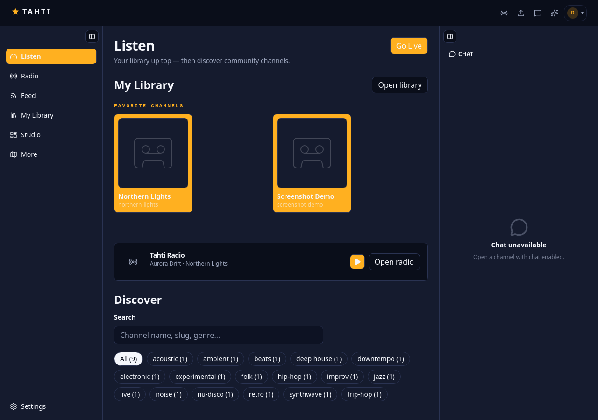
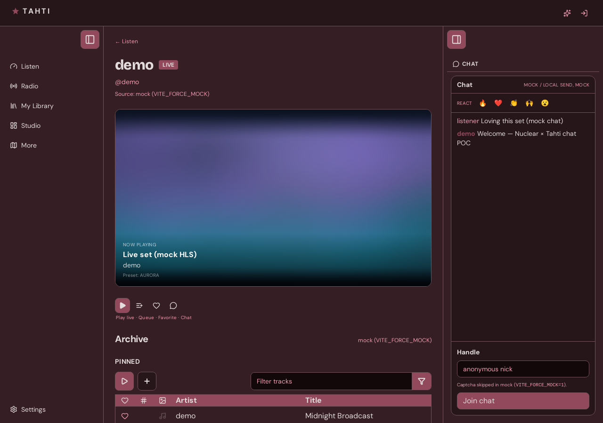
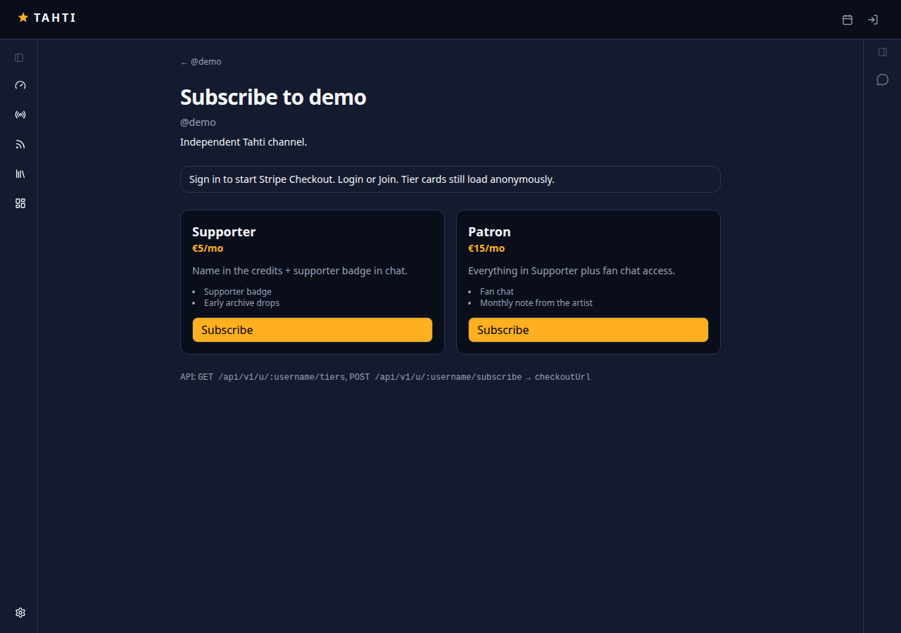
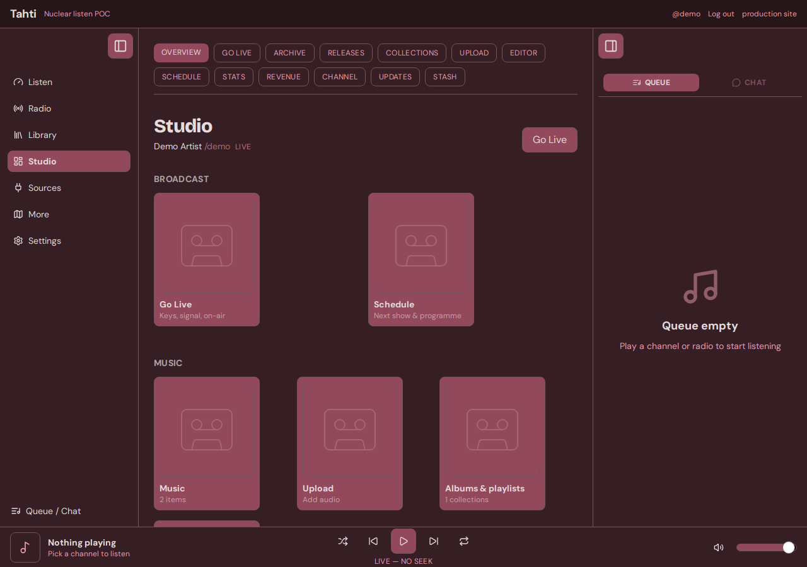
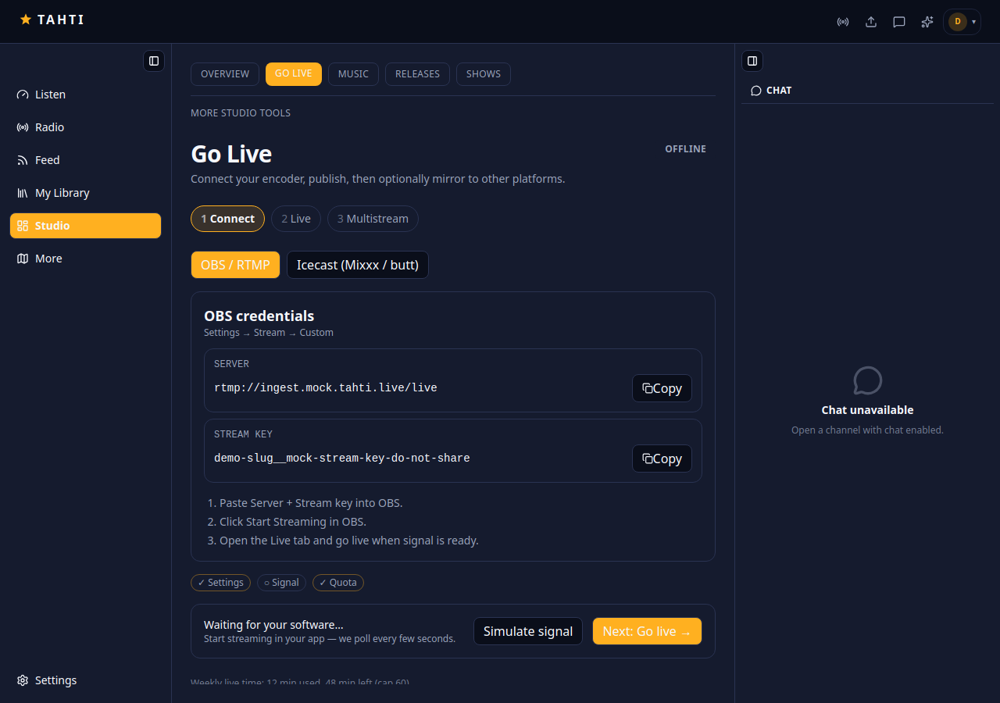
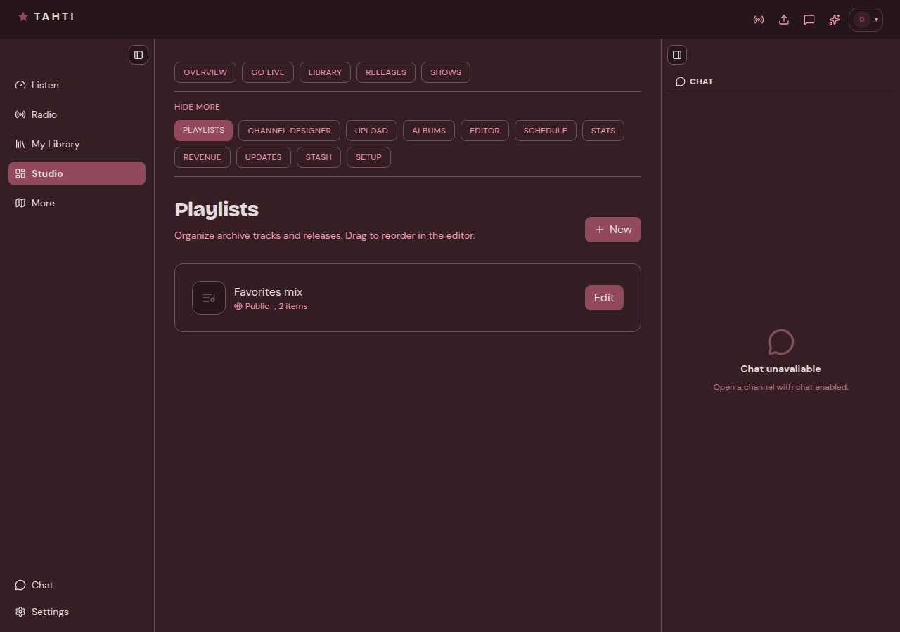

# @nuclearplayer/tahti-web

Tahti **listen + artist studio** client on Nuclear UI/themes. This is the beta cutover candidate for production `apps/web` (`app.tahti.live`).

Live: **[beta.tahti.live](https://beta.tahti.live)** — same-origin `/tahti-api` → `api.tahti.live`, chat on `wss://chat.tahti.live`.

## What / why

Tahti is a nonprofit channel-first platform: live broadcast, archive listen, fan subscriptions. Production still runs Next.js; this package rebuilds the listener and studio experience as a Vite SPA so the UI can share Nuclear’s player chrome (queue, themes, dense studio desk) while calling the **existing** public API.

It is not a second backend. Auth, HLS, Stripe fan-subs, DMs, and studio mutations hit the live Tahti API (or mocks when `VITE_FORCE_MOCK=1`). Roadmap to replace `apps/web`: [`CUTOVER.md`](CUTOVER.md). Parity tracker: [`FEATURES.md`](FEATURES.md).

## What it provides

- **Listen** — directory, channel live/archive, radio, profiles, collections, smart links, chat
- **Account** — login / TOTP / register / verify, follows, library, DMs, governance
- **Fan revenue** — subscribe tiers → Stripe Checkout; artist Connect / revenue in studio
- **Studio** — Go Live wizard, music + upload, releases, playlists & albums, channel designer, schedule, stats, distribution, settings

## Screenshots



*Listen — favorites, Tahti Radio, discover.*



*Channel — live stage, archive, chat.*



*Fan subscribe tiers.*



*Studio overview.*



*Go Live (OBS / RTMP).*



*Playlists.*

Full set: [`docs/redesign-shots/`](./docs/redesign-shots/). **Prod → Nuclear screen matrix** (anonymous → admin): [`docs/SCREEN-ATLAS.md`](./docs/SCREEN-ATLAS.md). Captures: `node scripts/capture-atlas-shots.mjs` against mock Vite.

## Run

```bash
export NVM_DIR="$HOME/.nvm" && . "$NVM_DIR/nvm.sh" && nvm use 22
pnpm --filter @nuclearplayer/tahti-web dev
# Offline demo (no API):
VITE_FORCE_MOCK=1 pnpm --filter @nuclearplayer/tahti-web dev
```

Open http://localhost:5180 — mock login: `demo@tahti.live` / any password.

- Port checklist (prod → POC): [`FEATURES.md`](FEATURES.md)
- Offline mocks: [`MOCKS.md`](MOCKS.md)
- Cutover: [`CUTOVER.md`](CUTOVER.md)
- Nuclear desktop MCP (as-is): [`docs/MCP.md`](docs/MCP.md) — run `pnpm --filter @nuclearplayer/player dev`, Settings → Integrations
- Repo overview: [`../../README.md`](../../README.md)

## IA (sparse sidebar)

| Sidebar | In-page |
| --- | --- |
| Listen / Radio / Library / Studio / Sources / More | as before |
| **Settings** | Nuclear-style sections (Themes live here — not a sidebar item) |

### Settings sections

Account · Artist · Channel & design · Broadcast · Money · Notifications · Themes · Connections

`/themes` and `/account` redirect into Settings.

## Deploy (beta.tahti.live)

Builds against the public API (`/tahti-api` → `api.tahti.live`) and publishes on Pi4 `:15180` (NPM → `192.168.2.6:15180`):

```bash
pnpm deploy:tahti-beta
```

See [`deploy/README.md`](deploy/README.md).

## Public API

Human docs: [`https://api.tahti.live/api`](https://api.tahti.live/api) (Scalar). OpenAPI JSON: `GET /api/openapi.json` on the same host.

## Docs

- Coverage map in-app: `/more`
- Plan: `WORKPLAN.md`
